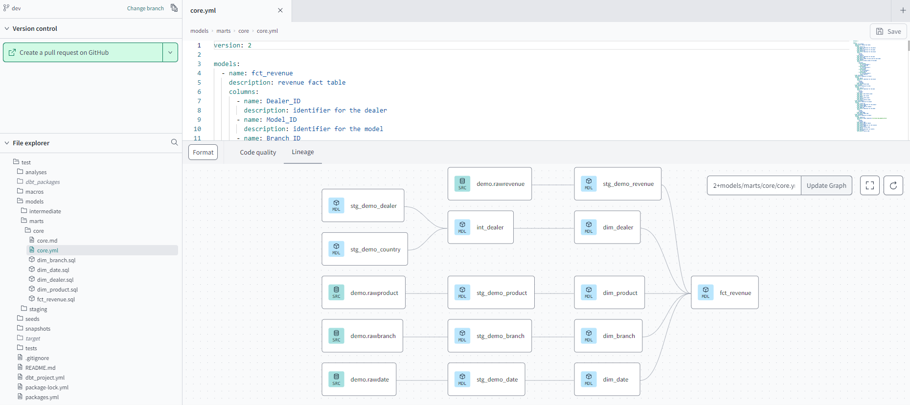
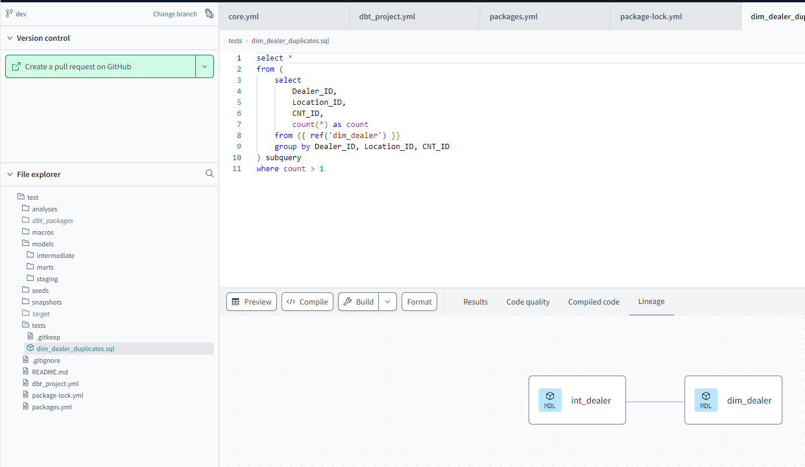

## Demo for DBT project

### What's included

#### Model stages

Three stages have been created for a proper transformation and aggregation of data:

+ Staging: first stage for the data.
+ Intermediate: some intermediate transformation.
+ Marts: final dimensions and fact table.

The structure is defined in the `core.yml` file.

#### Packages

The `packages.yml` file has been configured.

#### Custom test

A custom test has been included in addition to the default one, in order to detect duplicate data.

### Using the starter project

Try running the following commands:
- dbt run
- dbt test
- dbt docs generate

### Resources:
- Learn more about dbt [in the docs](https://docs.getdbt.com/docs/introduction)
- Check out [Discourse](https://discourse.getdbt.com/) for commonly asked questions and answers
- Join the [dbt community](https://getdbt.com/community) to learn from other analytics engineers
- Find [dbt events](https://events.getdbt.com) near you
- Check out [the blog](https://blog.getdbt.com/) for the latest news on dbt's development and best practices
