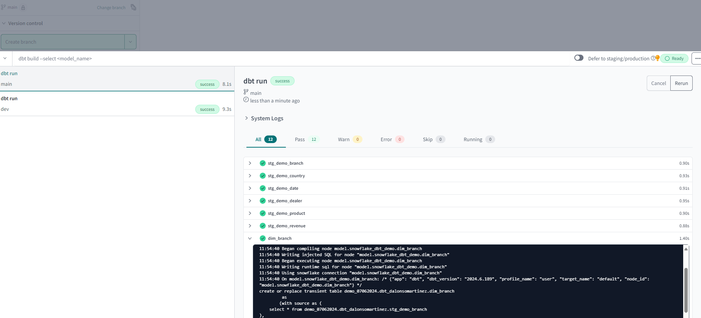

## Demo for DBT project

This DBT-Snowflake project has been made following these guides:
+ [Connect to Snowflake from DBT Cloud](https://www.youtube.com/watch?v=XH8ZGMmyG8A)
+ [Using dbt And Snowflake To Develop And Deploy Analytics Code | LAB](https://www.youtube.com/watch?v=84RA7TuhCpg&t=37s) and [Accelerating Data Teams with Snowflake and dbt Cloud Hands On Lab](https://quickstarts.snowflake.com/guide/accelerating_data_teams_with_snowflake_and_dbt_cloud_hands_on_lab/#0)

### What's included

#### Packages

The `packages.yml` file has been configured.

#### Model stages

Three stages have been created for a proper transformation and aggregation of data:

+ Staging: first stage for the data.
+ Intermediate: some intermediate transformation.
+ Marts: final dimensions and fact table.

The structure is defined in the `core.yml` file (check out the lineage while you are building and linking the models, awesome!)

##### Notes

+ Use Git control version from a GitHub or Azure DevOps repository and commit and push your changes.

+ Build your models by the basic command `dbt run` on `main` branch. Later on, see your changes on Snowflake.

#### Custom test

A custom test has been added in addition to the default ones (default data quality tests included in yaml files of each model), in order to detect duplicate data.

#### Autodocs generated

The default documentation from DBT has been generated.

### Resources

- Check the [Snowflake documentation](https://docs.snowflake.com/en/user-guide-getting-started)
- Learn more about dbt [in the docs](https://docs.getdbt.com/docs/introduction)
- Check out [Discourse](https://discourse.getdbt.com/) for commonly asked questions and answers
- Join the [dbt community](https://getdbt.com/community) to learn from other analytics engineers
- Find [dbt events](https://events.getdbt.com) near you
- Check out [the blog](https://blog.getdbt.com/) for the latest news on dbt's development and best practices
